# AI-Powered Google Calendar Assistant

> An intelligent, multi-platform personal calendar assistant leveraging OpenAI's Agent Framework, featuring natural language processing, routine learning, and proactive scheduling capabilities across WhatsApp, Web, and React Native interfaces.

---

## 🎯 Problem Statement

Modern calendar management is fragmented and time-consuming. Users struggle with:
- **Manual scheduling overhead**: Creating, updating, and managing calendar events requires multiple clicks and context switching
- **Lack of intelligence**: Traditional calendar apps don't learn from user patterns or proactively suggest optimizations
- **Platform fragmentation**: Users are forced to switch between different apps (messaging, calendar, web) to manage their schedule
- **Context loss**: No memory of past conversations or preferences, requiring users to repeat information

This project solves these challenges by providing a **unified, AI-powered personal assistant** that understands natural language, learns user routines, and proactively manages calendars across multiple platforms.

---

## 🏗️ Architecture Overview

The system follows a **layered, domain-driven architecture** with clear separation of concerns, dependency injection, and repository pattern implementation.

```mermaid
graph TB
    subgraph "Client Layer"
        TG[Telegram Bot<br/>Grammy Framework]
        WA[WhatsApp Integration<br/>Webhook API]
        WEB[Web UI<br/>React/Next.js]
        RN[React Native App<br/>iOS/Android]
    end

    subgraph "API Gateway - Express.js"
        ROUTES[Routes Layer<br/>RESTful Endpoints]
        MIDDLEWARE[Middleware<br/>Auth & Error Handling]
    end

    subgraph "Controller Layer"
        CAL_CTRL[Calendar Controller]
        USER_CTRL[Users Controller]
        WA_CTRL[WhatsApp Controller]
    end

    subgraph "Service Layer"
        CAL_SVC[Calendar Service]
        EVT_SVC[Event Service]
        MEM_SVC[Conversation Memory<br/>with Summarization]
        VEC_SVC[Vector Search<br/>Semantic Similarity]
        ROUT_SVC[Routine Learning<br/>Pattern Detection]
        STAT_SVC[Schedule Statistics]
        REM_SVC[Reminder Service]
        MODEL_ROUTER[Model Router<br/>Intelligent Model Selection]
    end

    subgraph "AI Agents Layer - OpenAI Agents Framework"
        ORCH[Orchestrator Agent<br/>Main Decision Engine]
        QUICK[Quick Response Agent<br/>Fast Acknowledgment]
        VALIDATE[Event Validation Agent]
        INSERT[Event Insertion Agent]
        GET_EVT[Event Retrieval Agent]
        UPDATE[Event Update Agent]
        DELETE[Event Deletion Agent]
        AUTH_AGENTS[OAuth & Auth Agents]
    end

    subgraph "Domain Layer - DDD"
        ENTITIES[Domain Entities<br/>Event, Calendar, User]
        DTOS[Data Transfer Objects]
        REPO_IFACE[Repository Interfaces<br/>Abstraction Layer]
        VO[Value Objects<br/>EventDateTime]
    end

    subgraph "Infrastructure Layer"
        REPOS[Repository Implementations<br/>Supabase & Google Calendar]
        CLIENTS[External API Clients]
        DI[Inversify IoC Container<br/>Dependency Injection]
    end

    subgraph "External Services"
        GOOGLE[Google Calendar API<br/>OAuth 2.0]
        SUPABASE[(Supabase<br/>PostgreSQL + Vector DB)]
        OPENAI[OpenAI API<br/>GPT-4o, GPT-4o-mini]
    end

    TG --> ROUTES
    WA --> ROUTES
    WEB --> ROUTES
    RN --> ROUTES

    ROUTES --> MIDDLEWARE
    MIDDLEWARE --> CAL_CTRL
    MIDDLEWARE --> USER_CTRL
    MIDDLEWARE --> WA_CTRL

    CAL_CTRL --> CAL_SVC
    USER_CTRL --> CAL_SVC
    WA_CTRL --> EVT_SVC

    CAL_SVC --> ENTITIES
    EVT_SVC --> ENTITIES
    MEM_SVC --> SUPABASE
    VEC_SVC --> SUPABASE
    ROUT_SVC --> SUPABASE

    CAL_SVC --> REPO_IFACE
    EVT_SVC --> REPO_IFACE

    REPO_IFACE --> REPOS
    REPOS --> CLIENTS
    REPOS --> SUPABASE

    CLIENTS --> GOOGLE

    ORCH --> QUICK
    ORCH --> VALIDATE
    ORCH --> INSERT
    ORCH --> GET_EVT
    ORCH --> UPDATE
    ORCH --> DELETE
    ORCH --> AUTH_AGENTS

    QUICK --> EVT_SVC
    VALIDATE --> ENTITIES
    INSERT --> EVT_SVC
    GET_EVT --> EVT_SVC
    UPDATE --> EVT_SVC
    DELETE --> EVT_SVC

    AUTH_AGENTS --> USER_CTRL

    ORCH --> OPENAI
    QUICK --> OPENAI

    DI --> REPOS
    DI --> CLIENTS
    DI --> CAL_SVC
    DI --> EVT_SVC

    style TG fill:#e3f2fd
    style WA fill:#e3f2fd
    style WEB fill:#e3f2fd
    style RN fill:#e3f2fd
    style ORCH fill:#fff9c4
    style ROUT_SVC fill:#e8f5e9
    style VEC_SVC fill:#e8f5e9
    style MODEL_ROUTER fill:#e8f5e9
    style DI fill:#e0f2f1
```



### Data Flow

1. **Request Flow**: `Client → Routes → Middleware → Controller → Service → Repository → External API`
2. **AI Agent Flow**: `User Message → Orchestrator → Specialized Agent → Service → Response`
3. **Learning Flow**: `Background Job → Routine Analysis → Pattern Detection → Database Storage`

---

## 🚀 Key Features

### 🤖 AI-Powered Natural Language Processing
- **Multi-Agent Orchestration**: Sophisticated agent system with specialized agents for different tasks
- **Intent Recognition**: Automatically infers user intent (create, update, delete, retrieve) from natural language
- **Context Awareness**: Maintains conversation memory with vector-based semantic search for similar past interactions
- **Proactive Suggestions**: Learns user patterns and proactively suggests optimal scheduling times

### 📱 Multi-Platform Integration

#### WhatsApp Integration
- **Webhook-based messaging**: Real-time calendar management via WhatsApp
- **Natural language commands**: "Schedule a meeting with John tomorrow at 3pm"
- **Event notifications**: Proactive reminders and updates

#### Web UI (React/Next.js)
- **Personal assistant interface**: Conversational UI for calendar management
- **Real-time updates**: Live synchronization with Google Calendar
- **Visual calendar view**: Traditional calendar interface with AI enhancements

#### React Native Mobile App
- **Native iOS/Android experience**: Full-featured mobile calendar assistant
- **Offline support**: Cached data for offline access
- **Push notifications**: Native reminder system

### 🧠 Intelligent Routine Learning

- **Pattern Detection**: Automatically identifies recurring events, time slot patterns, and event relationships
- **Confidence Scoring**: Adaptive learning algorithm that improves predictions over time
- **Predictive Scheduling**: Suggests optimal times based on learned patterns
- **Background Analysis**: Daily cron job (2 AM) analyzes user calendars for pattern detection
- **Goal Tracking**: Set and track personal goals (e.g., "go to gym 3 times a week")

### 🔍 Advanced Search & Memory

- **Vector Search**: Semantic similarity search for finding relevant past conversations
- **Conversation Summarization**: Automatic summarization every 3 messages to maintain context
- **Context Retrieval**: Intelligent context building from conversation history and user preferences

### ⚡ Intelligent Model Routing

- **Dynamic Model Selection**: Automatically routes requests to optimal AI models based on task complexity
- **Cost Optimization**: Uses faster, cheaper models for simple queries (GPT-4o-mini) and powerful models for complex tasks (GPT-4o)
- **47+ Model Support**: Comprehensive model configuration with capability mapping
- **Agent Caching**: Intelligent caching of agent instances for performance

---

## 🛠️ Tech Stack

### Backend
- **Runtime**: Node.js with TypeScript
- **Framework**: Express.js 5.x
- **AI Framework**: OpenAI Agents SDK (`@openai/agents`, `@openai/agents-core`, `@openai/agents-realtime`)
- **Database**: Supabase (PostgreSQL) with vector search capabilities
- **ORM/Query Builder**: Supabase Client SDK
- **Dependency Injection**: Inversify (IoC container)
- **Authentication**: OAuth 2.0 (Google Calendar), JWT
- **Background Jobs**: node-cron
- **Validation**: Zod schemas

### Frontend (Planned/In Development)
- **Web**: React/Next.js with TypeScript
- **Mobile**: React Native (iOS/Android)
- **State Management**: TBD
- **UI Framework**: TBD

### External Integrations
- **Google Calendar API**: Full CRUD operations, OAuth 2.0
- **OpenAI API**: GPT-4o, GPT-4o-mini, and 45+ other models
- **WhatsApp Business API**: Webhook integration
- **Telegram Bot API**: Grammy framework

### Development Tools
- **Testing**: Jest with 900+ tests, 42 test suites
- **Linting/Formatting**: Biome, ESLint
- **Type Safety**: TypeScript 5.9 with strict mode
- **Code Quality**: Ultracite
- **Git Hooks**: Husky with lint-staged
- **Package Manager**: npm/pnpm

### Architecture Patterns
- **Domain-Driven Design (DDD)**: Clear domain layer with entities, value objects, and repositories
- **Repository Pattern**: Abstraction layer for data access
- **Service Layer Pattern**: Business logic encapsulation
- **Dependency Injection**: Loose coupling via Inversify
- **DTO Pattern**: Data transfer between layers
- **Agent Pattern**: AI-powered decision making

---

## 📊 System Capabilities

### Calendar Operations
- ✅ Create events via natural language
- ✅ Update events (time, location, attendees, description)
- ✅ Delete single or multiple events
- ✅ Retrieve events with semantic search
- ✅ Multi-calendar support with automatic categorization
- ✅ Timezone handling with user preference detection

### AI Agent Tools
- `insert_event_handoff_agent` - Create calendar events
- `get_event_handoff_agent` - Retrieve events
- `update_event_handoff_agent` - Update existing events
- `delete_event_handoff_agent` - Delete events
- `get_user_routines` - Access learned patterns
- `get_upcoming_predictions` - Predict future events
- `suggest_optimal_time` - Optimal scheduling suggestions
- `get_routine_insights` - Schedule pattern analysis
- `set_user_goal` / `get_goal_progress` - Goal tracking
- `get_schedule_statistics` - Calendar analytics

### Routine Learning Capabilities
- **Recurring Event Detection**: Identifies daily, weekly, monthly patterns
- **Time Slot Analysis**: Learns user availability patterns
- **Event Relationship Mapping**: Detects event sequences and dependencies
- **Confidence Scoring**: Adaptive algorithm that improves with validation
- **Pattern Storage**: Persistent storage in `user_routines` table

---

## 🏛️ Architecture Highlights

### Domain-Driven Design
The codebase follows DDD principles with clear boundaries:
- **Domain Layer**: Pure business logic, no infrastructure dependencies
- **Infrastructure Layer**: External integrations (Google Calendar, Supabase)
- **Application Layer**: Use cases and orchestration
- **Presentation Layer**: Controllers and routes

### Dependency Injection
Using Inversify for IoC container:
- Loose coupling between layers
- Easy testing with mock implementations
- Configuration-driven service resolution

### Repository Pattern
Abstract data access through interfaces:
- `IEventRepository` - Event operations
- `ICalendarRepository` - Calendar operations
- `IUserRepository` - User management
- Concrete implementations for Supabase and Google Calendar

### AI Agent Architecture
Multi-agent system with:
- **Orchestrator Agent**: Main decision engine, routes to specialized agents
- **Specialized Agents**: Focused on specific tasks (validation, insertion, retrieval)
- **Handoff Agents**: Coordinate multi-step operations
- **Quick Response Agent**: Fast acknowledgment for simple queries

---

## 📈 Performance & Scalability

- **Agent Caching**: Intelligent caching of agent instances
- **Model Routing**: Cost and performance optimization through intelligent model selection
- **Background Processing**: Async routine analysis via cron jobs
- **Vector Search**: Efficient semantic search with Supabase vector capabilities
- **Connection Pooling**: Optimized database connections
- **Error Handling**: Comprehensive error handling with graceful degradation

---

## 🧪 Testing

- **900+ tests** across 42 test suites
- **Unit Tests**: Domain logic, services, utilities
- **Integration Tests**: API endpoints, database operations
- **Test Coverage**: Comprehensive coverage reporting
- **CI/CD Ready**: Jest configuration for continuous integration

---

## 🔐 Security

- **OAuth 2.0**: Secure Google Calendar authentication
- **JWT Tokens**: Secure session management
- **Row-Level Security (RLS)**: Database-level access control via Supabase
- **Input Validation**: Zod schema validation for all inputs
- **Error Sanitization**: No sensitive data in error responses

---

## 📝 Development Workflow

### Prerequisites
- Node.js 18+
- PostgreSQL (via Supabase)
- Google Cloud Project with Calendar API enabled
- OpenAI API key
- WhatsApp Business API credentials (for WhatsApp integration)

### Setup
```bash
# Install dependencies
npm install

# Configure environment variables
cp .env.example .env
# Add your API keys and configuration

# Run database migrations
# (Supabase migrations are in supabase/migrations/)

# Start development server
npm run dev
```

### Testing
```bash
# Run all tests
npm test

# Run with coverage
npm run test:coverage

# Watch mode
npm run test:watch
```

---

## 🗺️ Roadmap

### Completed ✅
- Core calendar CRUD operations
- AI agent orchestration system
- Routine learning and pattern detection
- Vector search and conversation memory
- Model routing system
- Telegram bot integration
- WhatsApp webhook infrastructure

### In Progress 🚧
- WhatsApp full message processing
- Web UI development
- React Native app development
- Advanced routine predictions
- Goal tracking system

### Planned 📋
- Schedule statistics dashboard
- Conflict detection and warnings
- Proactive reminder system
- Multi-language support
- Advanced analytics and insights

---

## 📚 Documentation

- [Architecture Diagram](./docs/architecture-diagram.md)
- [Implementation Status](./docs/IMPLEMENTATION_STATUS.md)
- [Model Router Design](./docs/model-router-design.md)
- [Routine Learning Implementation](./docs/routine-learning-implementation-plan.md)
- [Schedule Statistics Feature](./docs/schedule-statistics-feature.md)
- [Models Reference](./docs/models-reference.md)

---

## 🤝 Contributing

This is a personal project, but suggestions and feedback are welcome! Please feel free to open issues or discussions.

---

## 📄 License

ISC

---

## 👤 Author

Built with a focus on **clean architecture**, **type safety**, and **scalable design patterns**. This project demonstrates expertise in:
- Domain-Driven Design
- AI/ML integration
- Multi-platform development
- System architecture
- Test-driven development

---

**Built with ❤️ using TypeScript, Node.js, and OpenAI Agents Framework**

