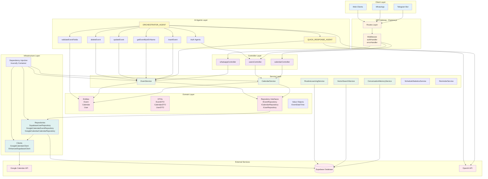

# AI Google Calendar Assistant - Architecture Diagram

## System Architecture Overview

## Layer Descriptions

### Client Layer
- **Telegram Bot**: Grammy-based bot for Telegram interactions
- **WhatsApp**: WhatsApp integration (in development)
- **Web Clients**: REST API clients

### API Gateway (Express.js)
- **Routes**: Express route definitions (calendarRoutes, users, whatsappRoutes)
- **Middleware**: Authentication and error handling middleware

### Controller Layer
- **calendarController**: Handles calendar-related HTTP requests
- **usersController**: Handles user authentication and management
- **whatsappController**: Handles WhatsApp webhook requests

### Service Layer
- **CalendarService**: Business logic for calendar operations
- **EventService**: Business logic for event CRUD operations
- **ConversationMemoryService**: Manages conversation context and memory
- **VectorSearchService**: Semantic search for calendar events
- **RoutineLearningService**: Analyzes user routines and patterns
- **ScheduleStatisticsService**: Provides calendar statistics
- **ReminderService**: Handles event reminders

### AI Agents Layer
- **ORCHESTRATOR_AGENT**: Main orchestrator for agent workflows
- **QUICK_RESPONSE_AGENT**: Fast response agent for simple queries
- **Specialized Agents**: validateEventFields, insertEvent, getEventByIdOrName, updateEvent, deleteEvent
- **Auth Agents**: User authentication and OAuth flow agents

### Domain Layer
- **Entities**: Core business entities (Event, Calendar, User)
- **DTOs**: Data Transfer Objects for API communication
- **Repository Interfaces**: Abstraction for data access
- **Value Objects**: Immutable domain concepts (EventDateTime)

### Infrastructure Layer
- **Repositories**: Concrete implementations (Supabase, Google Calendar)
- **Clients**: External API clients (Google Calendar, Supabase)
- **Dependency Injection**: Inversify container for IoC

### External Services
- **Google Calendar API**: Calendar and event management
- **Supabase**: Database and authentication
- **OpenAI API**: AI agent processing

## Data Flow

1. **Request Flow**: Client → Routes → Middleware → Controller → Service → Repository → External API
2. **Response Flow**: External API → Repository → Service → Controller → Client
3. **AI Agent Flow**: User Message → Orchestrator → Specialized Agent → Service → Response

## Key Design Patterns

- **Repository Pattern**: Abstracts data access layer
- **Service Layer Pattern**: Encapsulates business logic
- **Dependency Injection**: Loose coupling via Inversify
- **DTO Pattern**: Data transfer between layers
- **Agent Pattern**: AI-powered decision making

